<div align="center">

# 🧠 UniTalks — India's College-Only Peer Social Space

### *A Safe, Anonymous, Real-Time P2P Campus Communication & Collaboration Platform*

<br>

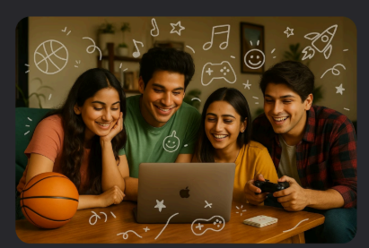

<br><br>

[](https://react.dev)
[](https://webrtc.org)
[](https://typescriptlang.org)
[](https://nodejs.org)
[](https://unitalks-live.netlify.app/)
[](https://www.youtube.com/watch?v=LDV3IZyBd_I)

<br>

**UniTalks is a modern, privacy-first peer-to-peer communication platform built exclusively for verified college students in India. Fostering authentic connections and positive mental wellness, the platform combines anonymous high-quality voice/video chat, collaborative workspaces, and regional accessibility (including native Indian Sign Language integration) in a judgment-free virtual space.**

[🚀 Getting Started](#-getting-started) · [📖 How It Works](#-how-it-works) · [🏗️ System Architecture](#%EF%B8%8F-system-architecture) · [📊 Traction & Analytics](#-real-time-analytics--growth) · [🎬 Demo Video](#-demo-video) · [📈 Market Opportunity](#-market-opportunity--swot)

</div>

---

## 📌 Table of Contents

- [✨ Highlights](#-highlights)
- [💡 Why UniTalks?](#-why-unitalks)
- [🚀 Key Features](#-key-features)
- [📸 Project Gallery](#-project-gallery)
- [📊 Real-Time Analytics & Growth](#-real-time-analytics--growth)
- [🏗️ System Architecture](#%EF%B8%8F-system-architecture)
- [💻 Technology Stack](#-technology-stack)
- [📁 Repository Structure](#-repository-structure)
- [🚀 Getting Started](#-getting-started)
- [🎬 Demo Video](#-demo-video)
- [📈 Market Opportunity & SWOT](#-market-opportunity--swot)
- [🤝 Contributing](#-contributing)
- [📄 License](#-license)

---

## ✨ Highlights

<table>
<tr>
<td width="55%">

🌐 **College-Verified Anonymous Space** — Only verified students join, ensuring campus safety and relatable interactions.

🔒 **Privacy-First Architecture** — Zero long-term data storage. High-quality P2P WebRTC data channels with Google OAuth sign-in.

🎭 **Anonymous Avatar Profiles** — Students select whimsical animal characters (Fox, Panda, Tiger, etc.) and custom screen names to eliminate social pressure.

🎮 **Built-in Engagement Tools** — Real-time peer play with chess and visual interaction boosters.

🧑‍💻 **Code-Along Collaboration** — Shared real-time coding environments to build, debug, and learn together.

👑 **King-Queen Algorithm** — A silent backend reputation engine prioritizing verified positive contributors to keep the community healthy.

</td>
<td width="45%">

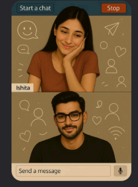

</td>
</tr>
</table>

---

## 💡 Why UniTalks?

<div align="center">
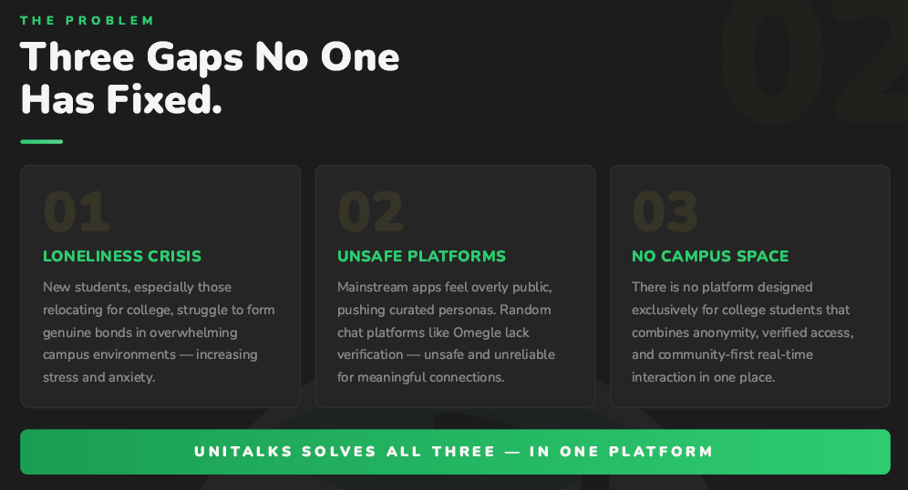
</div>

<br>

Relocating for university or attending virtual classes often leads to isolation. Traditional platforms fail to address these unique challenges:

| ❌ The Problem | ✅ How UniTalks Solves It |
|---|---|
| **Loneliness Crisis**: Students struggle to build meaningful peer bonds in overwhelming university environments, causing stress. | **One-tap P2P Connections**: Spontaneous, pressure-free, and judgment-safe text, audio, and video routes to meet peers. |
| **Unsafe Platforms**: Random chat networks (like Omegle/OmeTV) lack safety checks, leading to toxic, unverified interactions. | **Verified College Access**: Safe, anonymous-yet-verified environment where users are confirmed peers. |
| **No Dedicated Campus Space**: No unified platform combines student anonymity, peer verification, and real-time interaction. | **College & City Hubs**: Hyper-local group chats for campus discussions, peer support networks, and city-wide student connections. |

### 🏆 Competitive Comparison Matrix

Traditional social and chat applications don't come close to offering a verified, anonymous, and collaborative experience tailored for Indian college students:

<div align="center">
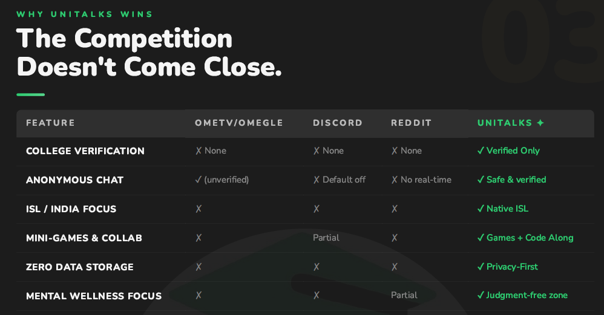
</div>

---

## 🚀 Key Features

<div align="center">
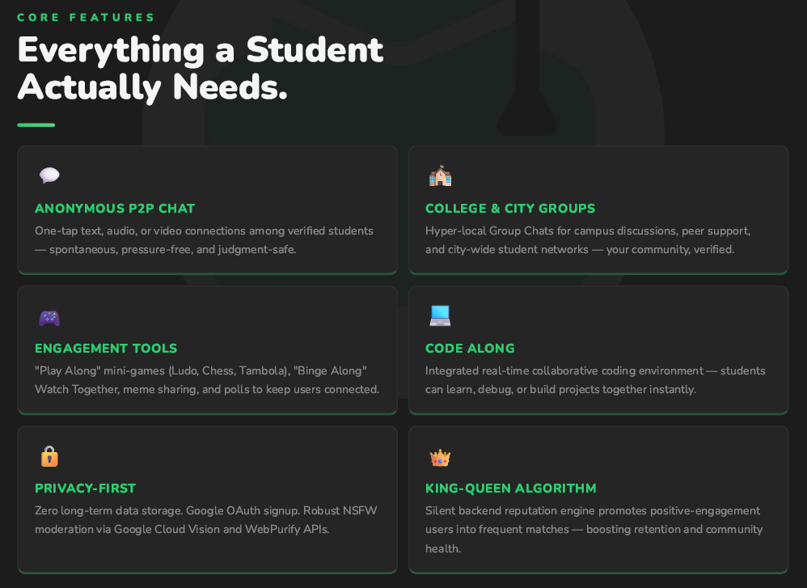
</div>

- **Anonymous P2P Chat**: Establish encrypted 1-on-1 audio/video sessions or text rooms. Handled fully peer-to-peer via `simple-peer` WebRTC streams.
- **College & City Groups**: Join curated, location-centric peer groups for campus discussions, sharing localized recommendations, or organizing mock interviews.
- **Real-Time Code Along**: Integrated collaborative code editors for developers to program, debug, and mentor each other during live sessions.
- **Engagement Tools & Games**: Embedded "Play Along" mini-games (such as Chess, with Ludo & Tambola planned) and "Binge Along" watch parties to keep interactions dynamic.
- **Moderation & Safety (Privacy-First)**: Google Cloud Vision and WebPurify integration for NSFW scanning, zero long-term logging, and strict OAuth authentication.
- **King-Queen Matching Algorithm**: Backend reputation model scoring positive engagements to optimize high-match rates and foster positive community behavior.

---

## 📸 Project Gallery

### 💻 Student Experience & User Flow

<table>
<tr>
<td width="50%" align="center">
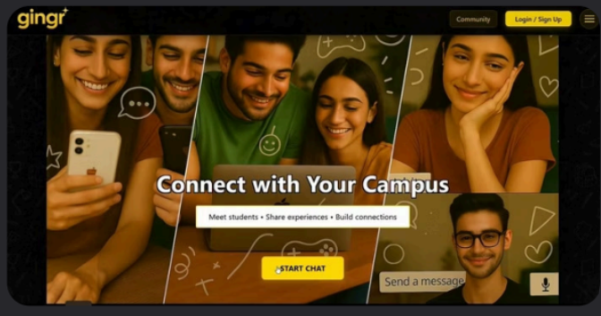
<br><em>Modern Student Landing Page (formerly Gingr)</em>
</td>
<td width="50%" align="center">
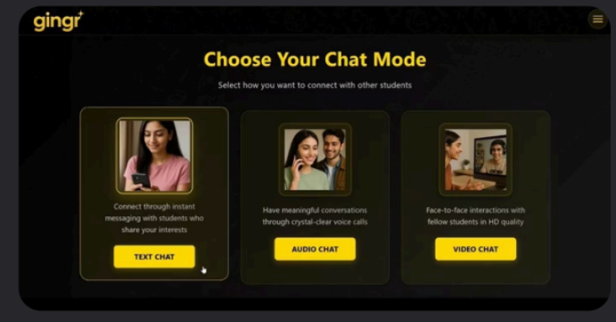
<br><em>Multi-Modal Chat Selection (Text, Audio, Video)</em>
</td>
</tr>
<tr>
<td width="50%" align="center">
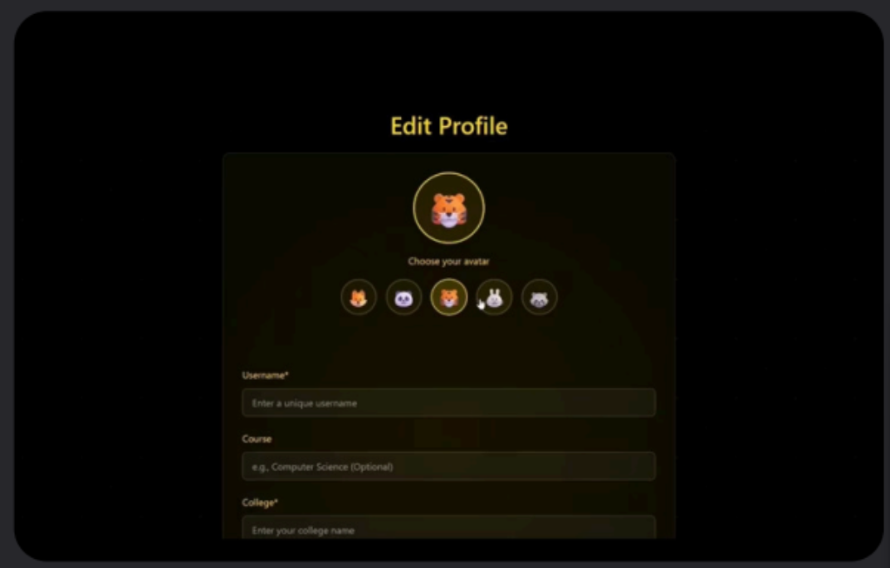
<br><em>Anonymous Avatar Selector & Profile Creator</em>
</td>
<td width="50%" align="center">
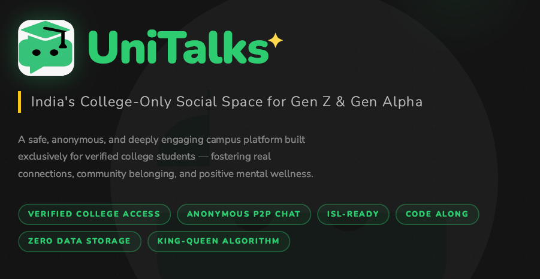
<br><em>UniTalks Platform Value Proposition</em>
</td>
</tr>
</table>

### 🏫 Localized Communities

<table>
<tr>
<td width="50%" align="center">
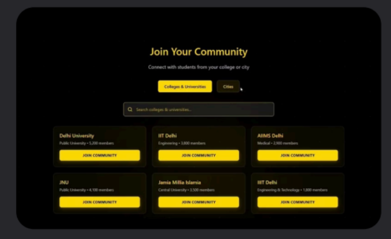
<br><em>Verified College & University Group Hubs</em>
</td>
<td width="50%" align="center">
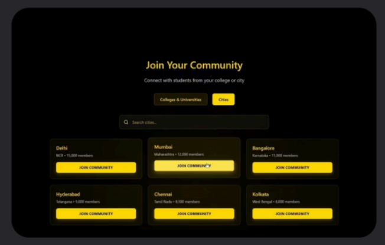
<br><em>City-Wide Geofenced Student Communities</em>
</td>
</tr>
</table>

---

## 📊 Real-Time Analytics & Growth

Unlike static school projects, UniTalks is a battle-tested platform with real market traction. Verified through Google Analytics metrics, the platform has achieved:

<table>
<tr>
<td width="50%">

### 📈 Key Metrics
- 👥 **30-Day Active Users**: **6,517+** engaged students.
- ⚡ **Platform Event Actions**: **98,620+** total events, including over **30,000+** engagement interactions and **5,900+** direct chat mode choices.
- 🚦 **Top Channels**: Highly organic, led by **Direct (886 sessions)** and **Organic Search (306 sessions)**.
- 🗺️ **Global Footprint**: Dominant engagement in India (677 active users) with expanding test users in the US (29), UK (6), and Germany (4).

</td>
<td width="50%">

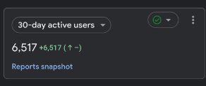

</td>
</tr>
</table>

#### Analytics Insights Snapshot
<div align="center">
<table>
<tr>
<td align="center">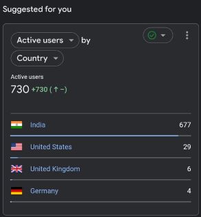</td>
<td align="center">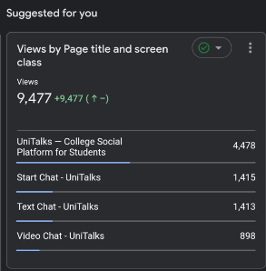</td>
</tr>
<tr>
<td align="center">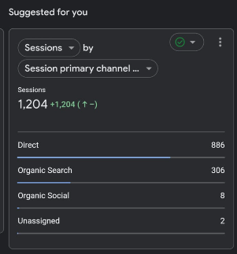</td>
<td align="center">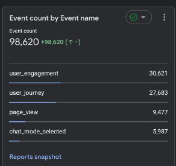</td>
</tr>
</table>
</div>

---

## 🏗️ System Architecture

UniTalks operates an offline-first signaling sequence with zero storage logs. The system orchestrates direct peer connections dynamically using WebSocket routing for high-efficiency WebRTC signaling.

### End-to-End WebRTC Signaling & P2P Stream

```
                                  ┌──────────────────┐
                                  │  Signaling Hub   │ (Node.js/TypeScript
                                  │ (WebSocket Server│  WS Service)
                                  └────────┬─────────┘
                                           │
                        1. Registration    │    2. Call Offer / Signaling
                           & User Match    │       Signal Exchange
                                           ▼
                 ┌──────────────────────────────────────────────────┐
                 ▼                                                  ▼
       ┌──────────────────┐                                ┌──────────────────┐
       │   Peer Client A  │◄──────────────────────────────►│   Peer Client B  │
       │ (SimplePeer SDK) │     3. Direct Peer-to-Peer     │ (SimplePeer SDK) │
       │     [REACT]      │         WebRTC Stream          │     [REACT]      │
       └────────┬─────────┘        (Audio, Video)          └────────┬─────────┘
                │                                                   │
                ├───────────► Built-in Chess Mini-Game (P2P Data) ◄─┤
                │                                                   │
                └───────────► Shared Code Along (Collab Workspace) ◄┘
```

1. **Signaling Initialization**: Client connects to the backend signaling hub via secure WebSockets.
2. **Dynamic Peer Discovery**: Matchmaking filters online users based on college networks or active modes.
3. **WebRTC Handshake**: Peer A generates an SDP offer, sent via the WebSocket signaling node to Peer B. Peer B returns an answer.
4. **P2P Connection Established**: Clients establish a direct peer-to-peer connection utilizing STUN server routing. Audio/Video/Data channels bypass the server entirely for complete user privacy.

---

## 💻 Technology Stack

### Frontend (Client)
- **Framework**: [React](https://react.dev) (v18.2.0) - High-efficiency component rendering.
- **Routing**: [React Router DOM](https://reactrouter.com/) (v6.22.0) - Secure layout boundaries and SPA state transitions.
- **P2P Audio/Video**: `simple-peer` (v9.11.1) - WebRTC connection abstraction.
- **Signaling Handler**: `socket.io-client` & WebSocket client (v4.7.2) - Handshake sync.
- **Styling**: `styled-components` (v6.1.8) - Modular, responsive theme-injected CSS-in-JS.
- **State & Games**: `chess.js` (v1.4.0) - P2P synchronized interactive engine.

### Backend (Server)
- **Runtime**: Node.js with TypeScript (`tsc` compiled).
- **Service API**: Express.js - Middleware routing.
- **Signaling Backbone**: `ws` (WebSockets) - Lightweight, low-overhead handshake processing.
- **Identity & Security**: JSON Web Tokens (JWT) & UUID - Secure session generation.

### Hosting & Infrastructure
- **Client**: Netlify (CI/CD connected to main branch).
- **Backend API**: Containerized via Docker / AWS Cloudfront deployments.

---

## 📁 Repository Structure

```
unitalks-video-chat/
├── package.json                      # Frontend configurations & packages
├── package-lock.json                 # Lock file for dependencies
├── amplify.yml                       # AWS Amplify CI/CD configuration
├── buildspec.yml                     # AWS CodeBuild file
├── cloudfront-full-config.json       # AWS Cloudfront schema mapping
│
├── public/                           # Static assets, manifests, index.html
│
├── src/                              # Client Application Source Code
│   ├── App.js                        # Client Router & Core Layout Switch
│   ├── index.js                      # React Root mounter
│   ├── config/
│   │   └── theme.js                  # Global color palettes & Spotify Green config
│   ├── utils/
│   │   └── performanceOptimizations.js # low-powered rendering & lag limits
│   │
│   └── components/
│       ├── layout/
│       │   ├── Header.js             # Sticky Glassmorphism Header
│       │   └── Footer.js             # Multi-link Footer
│       │
│       ├── pages/
│       │   ├── About.js              # Platform vision detail
│       │   ├── AudioChat.js          # P2P Voice-Only chat module
│       │   ├── Contact.js            # Customer contact form
│       │   ├── Help.js               # Helpdesk FAQs & issue logs
│       │   ├── Homepage.js           # Interactive Hero Landing View
│       │   ├── MaintenancePage.js    # Feature fallback warning
│       │   ├── Privacy.js            # GDPR/DPDP privacy documentation
│       │   ├── StartChat.js          # Main navigation dashboard
│       │   ├── Terms.js              # Platform user terms
│       │   ├── TextChat.js           # Socket-signaled text channel
│       │   └── VideoChat.js          # WebRTC audio/video stream module
│       │
│       └── ui/
│           ├── AudioVisualizer.js    # canvas voice activity grapher
│           ├── ChessBoard.js         # Chess game UI
│           ├── ReportBugModal.js     # Form modal to post bugs
│           ├── StartChatDoodles.js   # Dynamic SVG doodles
│           └── UniversalHamburger.js # Mobile burger navigation
│
├── server/                           # Signaling Server codebase
│   ├── package.json                  # Server dependencies (Express, ws, TS)
│   ├── tsconfig.json                 # TS Compiler config
│   ├── Dockerfile                    # Containerization script
│   └── src/
│       ├── index.ts                  # App entrypoint and WebSocket orchestrator
│       ├── config/                   # CORS and environment loaders
│       ├── middleware/               # Token validators & request loggers
│       ├── routes/                   # HTTP endpoints for health & config
│       ├── services/                 # Peer matchmaking & signaling handlers
│       └── types/                    # Common interface types
```

---

## 🚀 Getting Started

Follow these steps to run the complete peer-to-peer setup on your local workstation.

### Prerequisites
- Node.js (v18+ recommended)
- npm or yarn

### 1. Clone the Repository
```bash
git clone https://github.com/Hazz-Y/unitalks-video-chat.git
cd unitalks-video-chat
```

### 2. Configure Environment Variables
Create a `.env` file in the root folder for the frontend:
```env
REACT_APP_WEB3FORMS_KEY=your_web3forms_key_here
```
Create a `.env` file inside the `server/` directory:
```env
PORT=8080
JWT_SECRET=your_jwt_signing_secret
```

### 3. Start the Signaling Server
```bash
cd server
npm install
npm run dev
```
*The WebSocket server will start on port `8080` (or as configured).*

### 4. Start the React Client
Open a new terminal window in the root directory:
```bash
npm install
npm start
```
*The application should launch in your web browser at `http://localhost:3000`.*

---

## 🎬 Demo Video

Our MVP demonstration highlights the full student onboarding journey: anonymous profile initialization, college matchmaking, live WebRTC audio/video connections, and real-time interaction capabilities.

<div align="center">

[](https://www.youtube.com/watch?v=LDV3IZyBd_I)

*▶️ Click to watch the live platform MVP demo on YouTube (formerly ideated as Gingr)*

</div>

---

## 📈 Market Opportunity & SWOT

<div align="center">
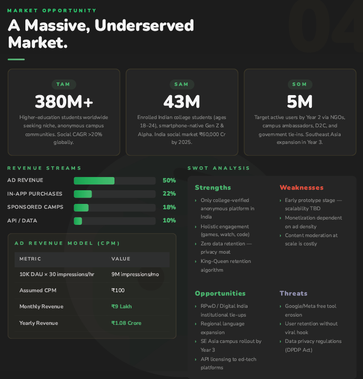
</div>

<br>

To demonstrate the commercial and strategic potential of the UniTalks product model, we mapped out its growth variables:

### 📐 Market Sizing
* **Total Addressable Market (TAM)**: **380M+** higher-education students worldwide seeking private, safe campus social spaces (Social platforms CAGR >20%).
* **Serviceable Addressable Market (SAM)**: **43M** Indian college students (Gen Z & Alpha). India's overall social market is projected at ₹60,000 Cr by 2025.
* **Serviceable Obtainable Market (SOM)**: **5M** active users targeted by Year 2 via NGOs, campus ambassadors, D2C rollouts, and institutional tie-ups.

### 📊 SWOT Matrix

| 🟢 Strengths | 🔴 Weaknesses |
|---|---|
| • Only college-verified anonymous platform in India.<br>• Multi-modal engagement (P2P video, Chess, Code Along).<br>• Zero data retention ensures privacy.<br>• King-Queen algorithm improves user retention. | • Early prototype stage (scalability tests ongoing).<br>• Initial monetization dependent on ad density.<br>• Real-time content moderation at high user volumes is costly. |
| **🔵 Opportunities** | **🟡 Threats** |
| • RPwD / Digital India institutional collaborations.<br>• Regional language expansion.<br>• SE Asia campus rollout by Year 3.<br>• API licensing to ed-tech platforms. | • Free tool erosion by legacy systems (Google Meet/Meta).<br>• User churn if viral retention loops fail.<br>• Stringent regional data regulations (e.g., DPDP Act). |

---

## 🤝 Contributing

Contributions are welcome! Please follow these guidelines:

1. **Fork** the repository.
2. **Create** a feature branch: `git checkout -b feature/your-feature-name`
3. **Commit** your changes: `git commit -m 'Add some feature'`
4. **Push** to the branch: `git push origin feature/your-feature-name`
5. **Open** a Pull Request.

---

<div align="center">

**⭐ If you like UniTalks, please give this repository a star!**

*Built with ❤️ for accessible, safe, and collaborative campus spaces.*

</div>
